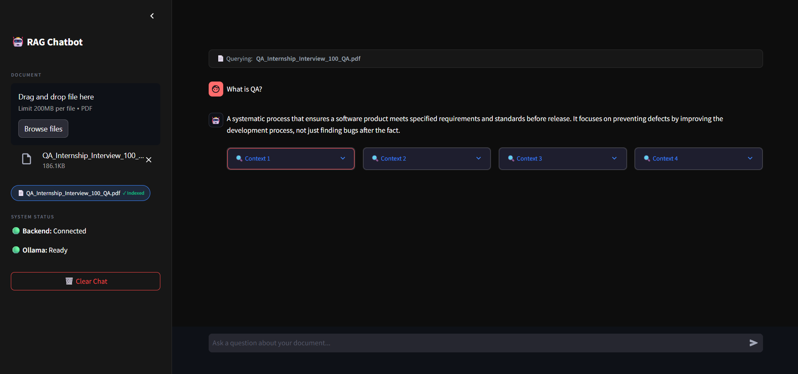

# RAG AI Chatbot — PDF Document Q&A System

A local-first, privacy-preserving Retrieval-Augmented Generation (RAG) system that indexes PDF documents into a vector store and answers user questions grounded strictly in the document context.

[](https://www.python.org/)
[](https://fastapi.tiangolo.com/)
[](https://github.com/langchain-ai/langchain)
[](https://www.trychroma.com/)
[](https://ollama.com/)
[](https://opensource.org/licenses/MIT)
[](#testing)

---

## Problem Statement

When analyzing large PDF documents (such as financial filings, research papers, or legal specifications), manually searching for specific insights is slow and inefficient. While cloud-based LLM APIs offer quick prototyping, they expose sensitive corporate data to external servers, incur high token costs, and are prone to "hallucinations" where the LLM invents answers missing from the source text. 

This project solves this by delivering a **100% local, privacy-preserving Q&A pipeline** that runs entirely on user hardware. By separating text parsing, vector searching, and response generation into a containerized, modular architecture, the system guarantees data security, runs cost-free, and enforces a grounded prompting strategy that cites source passages with matching relevance scores.

---

## Live Demo

### Walkthrough & Interaction Demo

https://github.com/j-coder-shan/RAG-AI-Chatbot/raw/feat/flat-repo-structure/docs/Demo%20video.mp4


### App Interface Screenshot



---

## Architecture

The system is structured as two decoupled pipelines (Ingestion and Query) orchestrated by FastAPI and LangChain.

### Ingestion Pipeline
```text
┌──────────────┐      ┌─────────────────────────┐      ┌───────────────────────────┐
│  PDF Upload  │ ───▶ │ Text Extraction (pypdf) │ ───▶ │   Recursive Text Splitter │
└──────────────┘      └─────────────────────────┘      │ (800 chars / 100 overlap) │
                                                       └─────────────┬─────────────┘
                                                                     │
                                                                     ▼
┌──────────────┐      ┌─────────────────────────┐      ┌─────────────┴─────────────┐
│   ChromaDB   │ ◀─── │  Generate Embeddings    │ ◀─── │        Text Chunks        │
│ Vector Store │      │ (nomic-embed-text/Ollama)│      └───────────────────────────┘
└──────────────┘      └─────────────────────────┘
```

### Query Pipeline
```text
                       ┌─────────────────────────┐
                       │  User Question (Query)  │
                       └────────────┬────────────┘
                                    │
                                    ▼
┌──────────────┐       ┌────────────┴────────────┐
│   ChromaDB   │ ───▶  │   Retrieve Top-k Chunks │
│ Similarity   │ ◀───  │ (Vector Cosine Search)  │
└──────────────┘       └────────────┬────────────┘
                                    │ (Retrieved Chunks + Scores)
                                    ▼
┌──────────────┐       ┌────────────┴────────────┐
│  Ollama LLM  │ ◀───  │ Grounded Prompt Builder │ ◀─── Instruct: Answer ONLY from context
│ (llama3.1:8b)│       └─────────────────────────┘
└──────┬───────┘
       │
       ▼
┌──────────────┐
│  Answer and  │
│ Source Chunks│
└──────────────┘
```

### Data Flow & Logic

*   **Embedding Model Alignment:** The same embedding model (`nomic-embed-text`) must be used for both ingestion and querying. Since embeddings map textual semantics into high-dimensional coordinate vectors, mixing models would represent the question and chunks in different dimensional spaces, making cosine similarity measurements mathematically meaningless.
*   **Grounded Responses:** The prompt builder restricts LLM answers strictly to the retrieved context chunks. Parametric knowledge (general training data) is bypassed, forcing the model to only generate answers that can be traced back to the document.
*   **Fallback Short-circuiting:** If no text chunks are found or if the highest-scoring chunk has a cosine similarity score below `0.1` (indicating lack of relevance), the query chain bypasses the LLM call entirely and returns: `"I could not find an answer in the document."` to prevent hallucination.

---

## Tech Stack

| Layer | Technology | Purpose |
| :--- | :--- | :--- |
| **Language** | Python 3.11+ | Core implementation |
| **Backend API** | FastAPI + Uvicorn | REST endpoints |
| **Frontend** | Streamlit | Chat UI + PDF uploader |
| **Orchestration** | LangChain | Pipeline wiring |
| **LLM** | Ollama — llama3.1:8b | Answer generation |
| **Embeddings** | Ollama — nomic-embed-text | Vector embeddings |
| **Vector Store** | ChromaDB (persistent) | Similarity search |
| **PDF Parsing** | pypdf | Text extraction |
| **Testing** | pytest + httpx | Unit + integration + system |
| **Containers** | Docker + Compose | Local deployment |

---

## Project Structure

```text
rag-chatbot/
├── .env.example              # Template for environment variables
├── .gitignore                # Specifies intentionally untracked files to ignore
├── README.md                 # System documentation and portfolio guide (this file)
├── docker-compose.yml        # Multi-container orchestration configuration for Docker
├── pytest.ini                # Pytest configuration file registering custom markers and paths
├── backend/
│   ├── Dockerfile            # Container configuration for the FastAPI backend
│   ├── requirements.txt      # Python package dependencies for the backend
│   └── app/
│       ├── __init__.py       # Initializes backend package
│       ├── chunking.py       # Splits raw text into overlapping semantic chunks
│       ├── config.py         # Environment variable loader and validator (dotenv)
│       ├── embeddings.py     # Ollama embeddings adapter factory
│       ├── loaders.py        # Text extractor for PDF files using pypdf
│       ├── main.py           # Main FastAPI application, CORS middleware, and routes
│       ├── rag_chain.py      # Orchestrates semantic retrieval and LLM prompting
│       ├── vectorstore.py    # Interface for ChromaDB vector operations (build, load, query)
│       └── routers/
│           ├── __init__.py   # Router package initialization
│           ├── chat.py       # REST router for the /chat query endpoint
│           └── upload.py     # REST router for the /upload PDF ingestion endpoint
├── frontend/
│   ├── Dockerfile            # Container configuration for the Streamlit UI
│   ├── app.py                # Streamlit chat interface and file uploading UI
│   └── requirements.txt      # Python package dependencies for the frontend
├── tests/
│   ├── __init__.py           # Initializes test package
│   ├── conftest.py           # Shared pytest fixtures (mock configurations and decorators)
│   ├── test_api.py           # Integration tests for backend REST endpoints
│   ├── test_chunking.py      # Unit tests for text chunking sizes and overlaps
│   ├── test_config.py        # Unit tests for environment variable validations
│   ├── test_embeddings.py    # Unit tests for the embedding client configurations
│   ├── test_loaders.py       # Unit tests for PDF text loaders (scanned, encrypted, empty)
│   ├── test_rag_chain.py     # Unit tests for query pipelines and liveness checks
│   ├── test_system.py        # End-to-end asynchronous system integration tests
│   └── test_vectorstore.py   # Unit tests for vector stores and document additions
├── data/
│   └── chroma/               # Gitignored directory containing persistent vector database files
└── uploads/                  # Gitignored directory temporarily storing uploaded files
```

---

## Getting Started

Choose one of the two setup paths below:

### PATH A — Run Locally (Recommended for development)

#### Prerequisites
*   Python 3.11+
*   [Ollama](https://ollama.com) installed and running locally
*   Git

#### Step-by-step Execution
1.  Clone the repository:
    ```bash
    git clone https://github.com/j-coder-shan/RAG-AI-Chatbot.git
    cd RAG-AI-Chatbot/rag-chatbot
    ```
2.  Create and activate a virtual environment:
    ```bash
    python -m venv venv
    # On Windows (PowerShell):
    .\venv\Scripts\activate
    # On macOS/Linux:
    source venv/bin/activate
    ```
3.  Install dependencies:
    ```bash
    pip install -r backend/requirements.txt
    pip install -r frontend/requirements.txt
    ```
4.  Copy environment configuration:
    ```bash
    cp .env.example .env
    ```
    *(All defaults in `.env` are configured to run local services out-of-the-box; no changes are required).*
5.  Pull the required models from Ollama:
    ```bash
    ollama pull nomic-embed-text
    ollama pull llama3.1:8b
    ```
6.  Start the FastAPI backend:
    ```bash
    uvicorn backend.app.main:app --reload --port 8000
    ```
7.  In a separate terminal window, start the Streamlit frontend:
    ```bash
    # (Ensure venv is activated)
    streamlit run frontend/app.py
    ```
8.  Open your browser and navigate to [http://localhost:8501](http://localhost:8501).

---

### PATH B — Run with Docker

#### Prerequisites
*   [Docker Desktop](https://www.docker.com/products/docker-desktop/) installed and running.

#### Step-by-step Execution
1.  Clone the repository:
    ```bash
    git clone https://github.com/j-coder-shan/RAG-AI-Chatbot.git
    cd RAG-AI-Chatbot/rag-chatbot
    ```
2.  Spin up the container stack:
    ```bash
    docker compose up -d --build
    ```
3.  Pull models into the containerized Ollama instance:
    ```bash
    docker exec -it rag-ollama ollama pull nomic-embed-text
    docker exec -it rag-ollama ollama pull llama3.1:8b
    ```
4.  Open your browser and navigate to [http://localhost:8501](http://localhost:8501).

*Note: On the first query after container spin-up, Ollama may take 15–30 seconds to load the pulled model weights into system memory.*

---

## Environment Variables

The application resolves configuration options through `.env`. All defaults are set to support local out-of-the-box development:

| Variable | Default | Description |
| :--- | :--- | :--- |
| `OLLAMA_BASE_URL` | `http://localhost:11434` | The host port URL for the local Ollama daemon. |
| `EMBEDDING_MODEL` | `nomic-embed-text` | Ollama model utilized for creating document semantic embeddings. |
| `CHAT_MODEL` | `llama3.1:8b` | Ollama LLM utilized to generate grounded chat answers. |
| `CHROMA_DIR` | `./data/chroma` | Directory path where local ChromaDB persistent sqlite database is stored. |
| `UPLOAD_DIR` | `./uploads` | Storage folder utilized for uploaded PDF files temporarily. |
| `CHUNK_SIZE` | `800` | Target chunk size (in characters) to subdivide PDF text. |
| `CHUNK_OVERLAP` | `100` | Target overlap size (in characters) between adjacent text chunks. |
| `RETRIEVAL_K` | `4` | Number of context chunks retrieved for prompt grounding. |
| `BACKEND_URL` | `http://localhost:8000` | The host port URL of the FastAPI backend router endpoints. |

---

## API Reference

Interactive API documentation is generated automatically by FastAPI and can be accessed at [http://localhost:8000/docs](http://localhost:8000/docs).

### 1. File Ingestion
*   **Endpoint:** `POST /upload`
*   **Description:** Uploads a PDF file, parses the text content, generates embeddings, and indexes chunks into a ChromaDB collection named after the PDF's filename stem.
*   **Request Type:** `multipart/form-data`
*   **Request Parameters:**
    *   `file`: The PDF file (must end in `.pdf`).
*   **Success Response (200 OK):**
    ```json
    {
      "status": "indexed",
      "collection_name": "project_report",
      "chunks": 18,
      "total_chunks": 18
    }
    ```
*   **Error Responses:**
    *   `400 Bad Request`: "Only PDF files are accepted." or "No extractable text found in PDF."
    *   `500 Internal Server Error`: Server failure during PDF processing or index construction.
*   **cURL Example:**
    ```bash
    curl -X POST "http://localhost:8000/upload" \
      -F "file=@/path/to/document.pdf"
    ```

### 2. Conversational Q&A
*   **Endpoint:** `POST /chat`
*   **Description:** Queries the RAG pipeline using a question and a target collection name.
*   **Request Type:** `application/json`
*   **Request Payload:**
    ```json
    {
      "question": "What is the chunk overlap size?",
      "collection_name": "project_report"
    }
    ```
*   **Success Response (200 OK):**
    ```json
    {
      "answer": "The chunk overlap size is configured to 100 characters.",
      "sources": [
        {
          "text": "CHUNK_SIZE is set to 800 and CHUNK_OVERLAP is set to 100.",
          "score": 0.8924,
          "index": 0
        }
      ]
    }
    ```
*   **Error Responses:**
    *   `400 Bad Request`: "Question cannot be empty or whitespace-only."
    *   `404 Not Found`: "Collection 'project_report' not found."
*   **cURL Example:**
    ```bash
    curl -X POST "http://localhost:8000/chat" \
      -H "Content-Type: application/json" \
      -d '{"question": "What is RAG?", "collection_name": "project_report"}'
    ```

### 3. Backend Liveness
*   **Endpoint:** `GET /health`
*   **Description:** Performs backend liveness checks by validating connectivity to the Ollama endpoint.
*   **Success Response (200 OK):**
    ```json
    {
      "status": "ok",
      "ollama": "reachable"
    }
    ```
*   **Error Response (503 Service Unavailable):**
    ```json
    {
      "detail": "Ollama is unreachable. Connection refused."
    }
    ```
*   **cURL Example:**
    ```bash
    curl -X GET "http://localhost:8000/health"
    ```

---

## Testing

The system implements a strict 3-layer verification strategy containing **48 automated tests** to guarantee system stability and prevent regression.

```bash
# Execute the full test suite
pytest -v --tb=short
```

### Layer 1 — Unit Tests
*   **Scope:** Verifies loader extractions, text chunking splits, mock configuration overrides, config failures, vector store operations, and prompt builds.
*   **Files:** `tests/test_loaders.py`, `tests/test_chunking.py`, `tests/test_embeddings.py`, `tests/test_config.py`, `tests/test_vectorstore.py`, `tests/test_rag_chain.py`
*   **Isolation:** Uses unittest mocks to avoid making actual Ollama network calls during unit test executions.
*   **Command:**
    ```bash
    pytest tests/test_loaders.py tests/test_chunking.py tests/test_embeddings.py tests/test_config.py tests/test_vectorstore.py tests/test_rag_chain.py -v
    ```

### Layer 2 — Integration Tests
*   **Scope:** Validates FastAPI routing, request payloads, API exception handling, and mock LLM calls using FastAPI `TestClient`.
*   **Files:** `tests/test_api.py`
*   **Command:**
    ```bash
    pytest tests/test_api.py -v
    ```

### Layer 3 — System / E2E Tests
*   **Scope:** Asynchronous black-box validation of the full pipeline (upload -> check collection -> semantic query -> verify sources and grounded response) against the actual FastAPI app using `httpx.AsyncClient`.
*   **Files:** `tests/test_system.py`
*   **Prerequisites:** Requires a running local Ollama service.
*   **Command:**
    ```bash
    pytest tests/test_system.py -v
    ```

---

## Design Decisions

Below are the key design choices made when implementing this architecture:

1.  **Chunk Size 800 / Overlap 100**
    *   *Decision:* Subdivided text into 800-character chunks with 100-character overlaps using LangChain's `RecursiveCharacterTextSplitter`.
    *   *Why:* Smaller chunk sizes yield highly focused vectors, improving retrieval precision. A 100-character overlap preserves semantic context between adjacent chunks, preventing sentences cut mid-thought from losing meaning.
2.  **Model Embedding Consistency**
    *   *Decision:* Enforced the use of `nomic-embed-text` consistently for both document indexing and user query vectorization.
    *   *Why:* Vector similarity (cosine distance) relies on queries and documents living in the exact same vector space. Mixing embedding models maps texts into disparate dimensions, rendering similarity measurements mathematically meaningless.
3.  **Local-only (Ollama) instead of OpenAI API**
    *   *Decision:* Executed LLM and embedding pipelines entirely locally using Ollama (`llama3.1:8b` and `nomic-embed-text`).
    *   *Why:* Guarantees absolute data privacy (no document text leaves the host), eliminates API costs/rate limits, and makes it trivial for reviewers to run and review the repository without purchasing tokens or setting up proprietary API keys.
4.  **ChromaDB over FAISS**
    *   *Decision:* Implemented ChromaDB as the vector store backend with local sqlite persistence.
    *   *Why:* ChromaDB supports persistence out-of-the-box without requiring manual serialization/deserialization. It handles multi-document isolation natively via named collections.
5.  **Hallucination Prevention via Prompt Engineering & Similarity Thresholds**
    *   *Decision:* Instructed the LLM to reply strictly with `"I could not find an answer in the document."` if context is insufficient, coupled with similarity score filtering (cutoff at `0.1`).
    *   *Why:* Commercial RAG applications must prioritize accuracy over guessing. Enforcing strict grounded prompts and short-circuiting low-similarity retrievals prevents hallucination and guarantees source traceability.

---

## Known Limitations

*   **Scanned PDFs / OCR:** The document parser does not support scanned image-only PDFs. Text extraction is handled by `pypdf`, which reads raw text characters. Integrating OCR (like `pytesseract`) is needed to support scanned files.
*   **Session Management:** The frontend UI is restricted to querying one active document per session. Querying across multiple files simultaneously requires implementing collection selectors in the Streamlit interface.
*   **System Hardware Requirements:** Running `llama3.1:8b` requires at least 8GB of system RAM/VRAM. For lower-spec systems, users must swap to `phi3:mini` by editing `CHAT_MODEL` in `.env`.
*   **Auth and Security:** The backend endpoints do not contain user authentication or namespace isolation, making them unsuitable for multi-tenant production hosting as-is.
*   **Latency on CPU:** Running LLM inference on CPU results in generation latencies of 5–15 seconds per question. Enabling GPU acceleration (CUDA on Windows/Linux or Metal on macOS) in the local Ollama settings reduces latency to sub-second speeds.

---

## Roadmap

*   [ ] Integrate OCR support for scanned/scanned-image PDFs (pytesseract).
*   [ ] Implement multi-document support with collection selector dropdown in Streamlit UI.
*   [ ] Add streaming answers (FastAPI `StreamingResponse` + Streamlit `st.write_stream`).
*   [ ] Configure GPU acceleration support via Ollama CUDA/Docker configuration.
*   [ ] Deploy staging version to cloud instances with mock backend service.

---

## About the Author

Hi, I'm **Prabod Jayasinghe (Shan)**, a final-year Electronics and Computer Science undergraduate at the University of Kelaniya, Sri Lanka.

*   **GitHub:** [j-coder-shan](https://github.com/j-coder-shan)
*   **LinkedIn:** [Prabod Jayasinghe](https://www.linkedin.com/in/prabod-jayasinghe-76323830a/)
*   **Portfolio:** [Shan's Portfolio](https://portfolio-bay-rho-25.vercel.app/)
